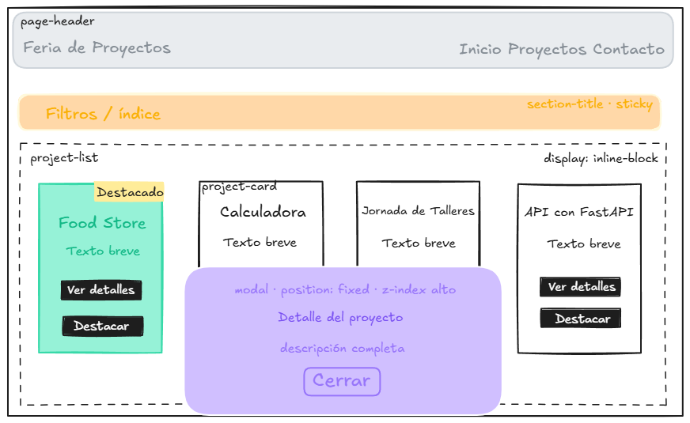
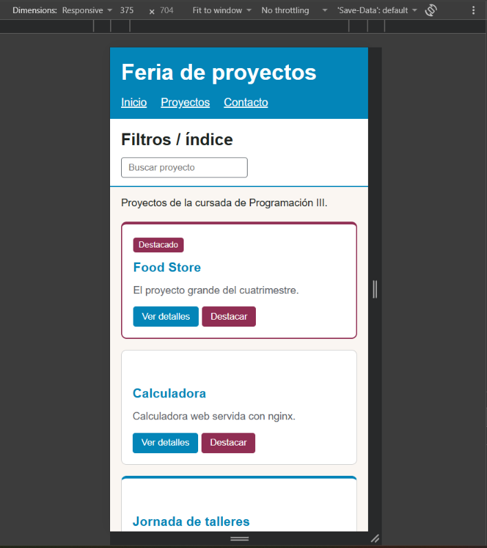
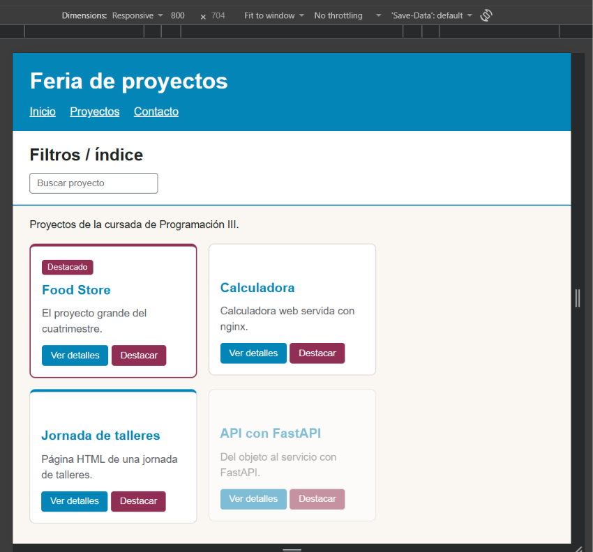
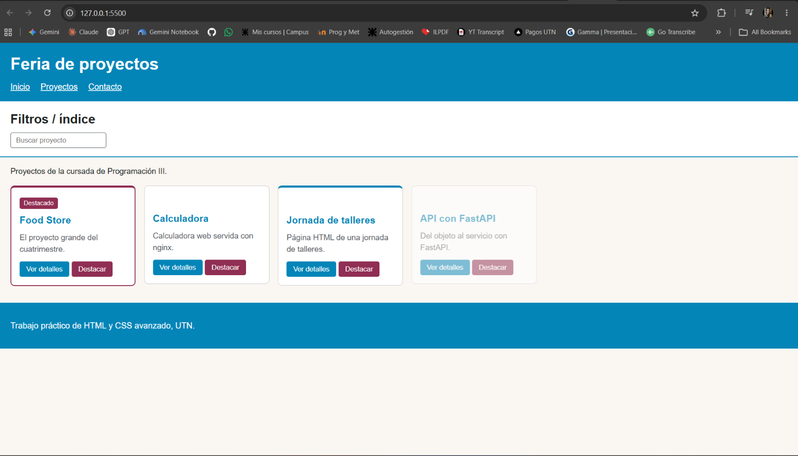
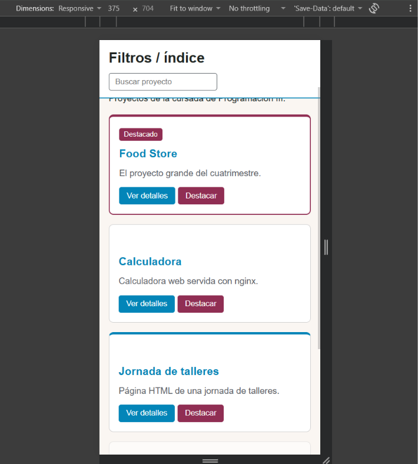
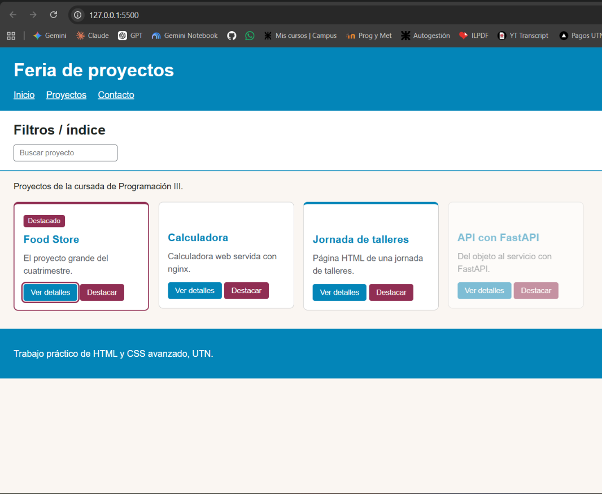
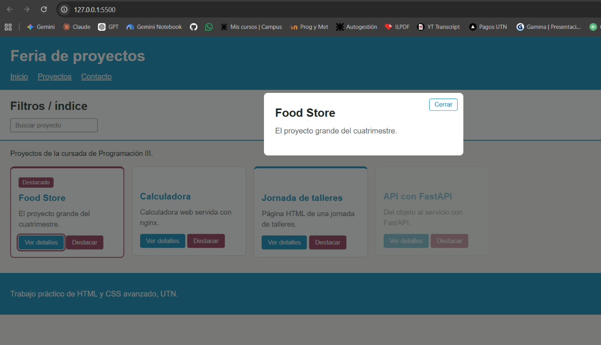
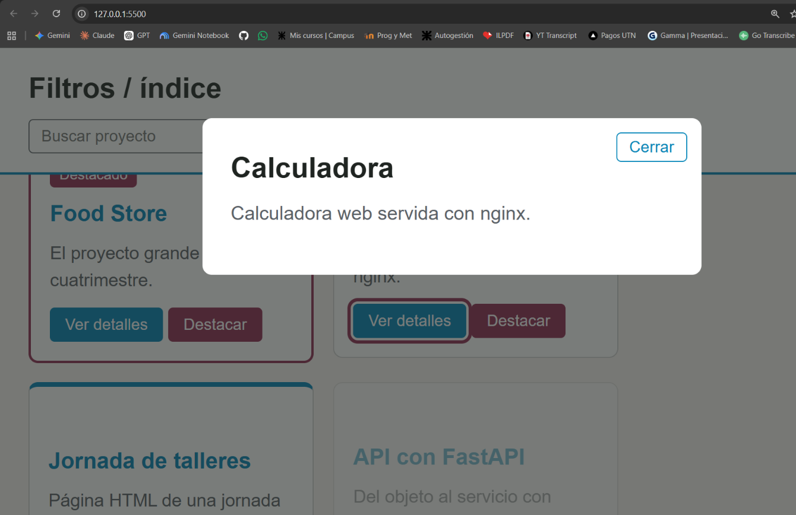

# Feria de proyectos

Actividad práctica de **Programación III (UTN)**: una página web responsive que muestra una feria de proyectos con tarjetas, navegación y un panel de detalle. El foco está en la metodología **BEM** y en CSS avanzado: `display`, `visibility`, `opacity`, `z-index`, selectores avanzados y posicionamiento.

Tecnologías: HTML, CSS y JavaScript básico (solo para abrir y cerrar el modal y marcar tarjetas como destacadas).

## Roles

La actividad es grupal, pero la realicé de forma individual, así que asumí los cuatro roles sugeridos: HTML/BEM, layout y posicionamiento, interacciones/estados, e integración y presentación.

## Planificación

### Temática

Proyectos de la cursada: Food Store (el proyecto del cuatrimestre), Calculadora, Jornada de talleres y API con FastAPI.

### Wireframe

En el código, el badge "Destacado" quedó dentro del flujo normal y no montado en la esquina como en el wireframe. Así el espacio que deja con `visibility: hidden` se ve en las tarjetas no destacadas y se puede comparar con `display: none`.

### Inventario BEM

| Bloque | Elementos | Modificadores |
|---|---|---|
| `page-header` | `__title`, `__nav`, `__link` | `page-header__link--active` |
| `section-title` | `__text`, `__filters`, `__input` | |
| `project-list` | `__intro` | |
| `project-card` | `__title`, `__text`, `__badge`, `__actions`, `__button` | `--featured`, `--dimmed`, `__badge--hidden`, `__button--primary`, `__button--secondary` |
| `modal` | `__overlay`, `__panel`, `__title`, `__text`, `__close` | `modal--open` |
| `page-footer` | `__text` | |

Convención: minúsculas, guiones simples dentro del nombre, `__` para elementos y `--` para modificadores. Cada modificador se usa junto con su clase base (por ejemplo `project-card project-card--featured`).

## Display y visibilidad

| Propiedad | Dónde | Qué pasa |
|---|---|---|
| `display: block` | `page-header`, `section-title`, `project-list`, `page-footer` | Organiza las zonas verticales de la página |
| `display: inline-block` | `project-card`, `project-card__button` | Tarjetas y botones alineados en una misma línea |
| `display: none` | `.modal` (cerrado) | Desaparece y **no ocupa espacio** |
| `visibility: hidden` | `project-card__badge--hidden` | No se ve, pero **conserva su espacio** (por eso las tarjetas no destacadas tienen un hueco arriba) |
| `opacity: 0.5` | `project-card--dimmed` | La tarjeta se ve atenuada, pero **conserva su espacio y sigue recibiendo clics** |

## Posicionamiento y apilamiento

| Propiedad | Dónde | Por qué |
|---|---|---|
| `position: sticky` (`top: 0`) | `section-title` | La barra de filtros queda visible al hacer scroll sin dejar de ocupar su lugar en el flujo |
| `position: fixed` | `modal` | El modal queda fijo sobre toda la ventana, aunque se haga scroll |
| `position: absolute` | `modal__overlay` y `modal__close` | El fondo oscuro cubre toda la ventana y el botón cerrar se ubica en la esquina del panel, sin ocupar lugar en el flujo |
| `position: relative` | `modal__panel` | Es el contenedor de referencia del botón cerrar |
| `z-index` | modal (100), barra sticky (10), panel sobre overlay (1 y 0) | El modal queda por delante de la barra sticky, y el panel por delante del fondo oscuro |

## Selectores avanzados y estados

- **Descendente:** `.project-list p` da el tamaño del texto de introducción.
- **Hijo directo:** `.project-card > .project-card__title` colorea el título de cada tarjeta.
- **`:nth-child(even)`:** las tarjetas pares llevan una línea azul arriba. El `p` de introducción es el hijo 1, así que las tarjetas son los hijos 2 a 5.
- **`:hover`:** las tarjetas se elevan con sombra y los botones se aclaran.
- **`:focus`:** el buscador y los botones muestran un contorno borgoña visible al navegar con teclado.

## Interacciones (JavaScript)

- **Ver detalles:** copia el título y el texto de la tarjeta al modal y le agrega `modal--open`.
- **Cerrar:** botón "Cerrar", clic en el fondo oscuro o tecla Escape (le quita `modal--open`).
- **Destacar:** alterna `project-card--featured` y muestra u oculta el badge. El HTML no se borra en ningún caso.

## Pruebas realizadas

| Prueba | Resultado | Evidencia |
|---|---|---|
| Ventana angosta (375 px) | Una tarjeta por línea a todo el ancho, sin scroll horizontal |  |
| Ventana media (800 px) | Dos tarjetas por línea |  |
| Ventana ancha | Las cuatro tarjetas en una sola línea |  |
| Barra sticky | Queda pegada arriba mientras las tarjetas pasan por debajo |  |
| Navegación por teclado | El foco recorre menú, buscador y botones con contorno visible |  |
| Aparición y cierre del panel | Se abre con "Ver detalles" y se cierra con el botón, el fondo o Escape |  |
| Superposición (`z-index`) | El fondo oscuro del modal tapa la barra sticky |  |
| Hover y Destacar | Las tarjetas y botones reaccionan; Destacar agrega y quita el badge y el borde | |

## Limitaciones conocidas

- Con el modal abierto, la tecla Tab todavía pasa por los elementos que quedan detrás. Un modal totalmente accesible debería atrapar el foco adentro.
- El buscador es solo visual: sirve para demostrar `:focus` y todavía no filtra los proyectos.

## Cómo verlo

Clonar el repositorio y abrir `index.html` en el navegador (o usar la extensión Live Server de VS Code).